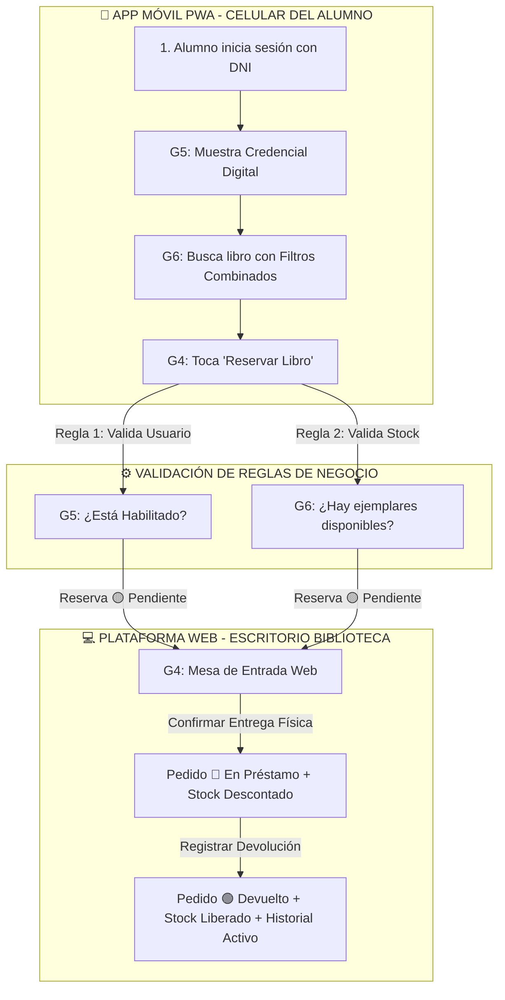

# 🎬 Hilo Conductor e Integración End-to-End — Sistema de Gestión de Biblioteca

> **Proyecto:** Sistema de Gestión de Biblioteca (E.E.S.T. N° 5 - 2026)  
> **Propósito:** Explicar el ciclo de vida completo de una reserva y préstamo conectando el trabajo de los **Grupos 4, 5 y 6**.  
> **Documento Oficial de Origen:** PDF Requerimientos Grupo B  

---

## 🗺️ Mapa de Interconexión de Módulos

---

## 📖 La Historia Completa del Proyecto (Paso a Paso)

### 🎬 Escena 1: Identificación y Perfil (Módulo Grupo 5)
1. **Juan (Alumno de 7mo 5ta)** abre la PWA en su celular.
2. Ingresa su DNI en la pantalla de **Inicio de Sesión** (desarrollada por el **Grupo 5**).
3. Al ingresar, la app le despliega su **Credencial Digital** con sus 6 atributos obligatorios (*Nombre completo, DNI, Curso, Correo, Teléfono y Dirección*).
4. Su credencial muestra una etiqueta verde: 🟢 **Habilitado**.

---

### 🎬 Escena 2: Búsqueda en el Catálogo Móvil (Módulo Grupo 6)
1. Juan navega hacia la sección de **Catálogo** (desarrollada por el **Grupo 6**).
2. Usa la barra de búsqueda y los **filtros combinados**: selecciona la categoría *"Técnica"*, escribe *"Física"* y marca la casilla *"Solo disponibles"*.
3. En pantalla aparecen las tarjetas de los libros. Juan ve el libro *"Física I"* con su portada, autor y una etiqueta verde: 🟢 **Disponible (Stock: 2 ejemplares)**.
4. Presiona sobre la tarjeta para ver los detalles.

---

### 🎬 Escena 3: Solicitud de Reserva y Validaciones (Módulo Grupo 4)
1. En la ficha del libro, Juan presiona el botón **"Reservar Libro"** (módulo desarrollado por el **Grupo 4**).
2. La app genera una solicitud con los 5 campos obligatorios del pedido:
   * **Usuario:** Juan Perez (DNI 45123456)
   * **Libro:** Física I (ID 12)
   * **Cantidad:** 1 ejemplar
   * **Fecha de Pedido:** Hoy
   * **Fecha de Devolución Estimada:** En 7 días
3. **Validación Automática de las 2 Reglas de Negocio:**
   - **Consulta al Grupo 6 (Stock):** ¿*Física I* tiene stock libre? $\rightarrow$ **SÍ (quedan 2).**
   - **Consulta al Grupo 5 (Usuario):** ¿Juan Perez está habilitado sin sanciones? $\rightarrow$ **SÍ (está 🟢 Habilitado).**
4. La reserva queda confirmada en estado **🟡 Pendiente de Retiro**.

---

### 🎬 Escena 4: Retiro en Mostrador y Actualización de Stock (Módulos G4 y G6)
1. Juan camina hasta la biblioteca de la escuela.
2. El bibliotecario abre la **Plataforma Web (Mesa de Entrada del Grupo 4)** en la computadora.
3. El bibliotecario ve la solicitud en pantalla, busca el libro en el estante y se lo entrega a Juan presionado **"Confirmar Entrega"**.
4. En ese instante exacto:
   - El pedido pasa al estado 🔵 **En Préstamo**.
   - El módulo del **Grupo 6** descuenta 1 unidad del stock disponible de *"Física I"* (pasa de 2 a 1).

---

### 🎬 Escena 5: Devolución y Registro en Historial (Módulos G4, G5 y G6)
1. A los 5 días, Juan regresa a la biblioteca y entrega el libro en el mostrador.
2. El bibliotecario busca el préstamo en la Web (Grupo 4) y presiona **"Registrar Devolución"**.
3. El sistema realiza 3 acciones automáticas:
   - **Grupo 4:** El pedido cambia a estado 🟢 **Devuelto**.
   - **Grupo 6:** El stock de *"Física I"* vuelve a sumarse (vuelve a 2 ejemplares disponibles).
   - **Grupo 5:** La transacción se suma al **Historial Activo** de Juan como una entrega completada a tiempo.

---

### 🎬 Escena 6: Caso de Excepción (Atraso y Suspensión)
1. Si Juan no hubiese devuelto el libro al séptimo día:
2. El pedido pasa al estado 🔴 **Vencido** (Grupo 4).
3. El **Grupo 5** cambia automáticamente la condición de Juan a 🔴 **Suspendido por Atraso**.
4. La próxima vez que Juan intente reservar un libro desde la PWA, la app le mostrará un aviso: *"No podés solicitar libros por registrar un atraso pendiente"*.

---

📌 *Hilo Conductor Integrado — E.E.S.T. N° 5 (2026)*
